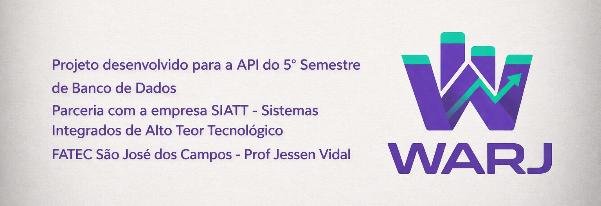
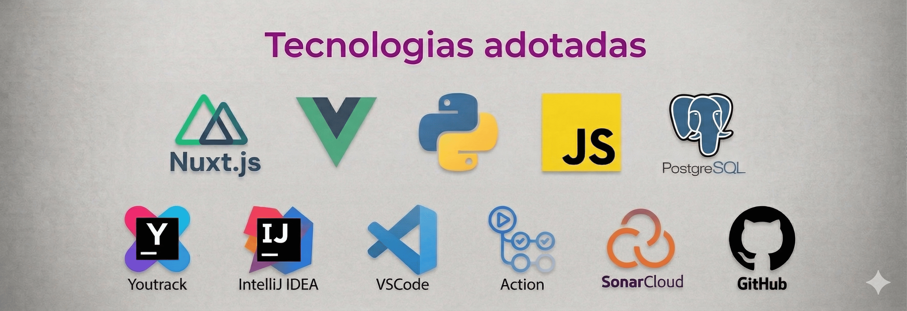

## Índice

    <a href="README.md">English Version</a> |
    <a href="#introduction">Introdução</a> |
    <a href="#partner_company">Empresa Parceira: SIATT</a> |
    <a href="#challenge">Desafio</a> |
    <a href="#solution">Solução</a> |
    <a href="#product-backlog">Backlog do Produto</a> |
    <a href="#fr_nfr">Requisitos Funcionais e Não Funcionais</a> |
    <a href="#calendar">Cronograma das Sprints</a> |
    <a href="#sprint-summary">Resumo das Sprints</a> |
    <a href="#project-structure">Estrutura do Projeto</a> |
    <a href="#documentation">Documentação</a> |
    <a href="#team">Sobre a Equipe</a> |
    <a href="#technologies">Tecnologias Utilizadas</a>

## Introdução

O **WARJ Insights** é um projeto desenvolvido pela equipe **WARJ**, composta por estudantes do 5º semestre do curso de **Banco de Dados da FATEC São José dos Campos**.

A iniciativa tem como foco a construção de uma solução de análise de dados, voltada à geração de **insights a partir de informações históricas**. O projeto organiza dados dispersos em uma base estruturada, permitindo identificar padrões, tendências e apoiar a tomada de decisão de forma objetiva e orientada ao negócio.

→ <a href="#warj-group">Home</a>

## Empresa Parceira: SIATT

A **[SIATT (Sistemas Integrados de Alto Teor Tecnológico)](https://www.siatt.com.br/a-empresa?lang=pt)** é uma empresa brasileira do setor de defesa, especializada no desenvolvimento de sistemas avançados, com foco em armamentos inteligentes e tecnologias embarcadas.

Com atuação nacional e internacional, a empresa trabalha na criação e integração de soluções para aplicações aéreas, navais e terrestres, incluindo sistemas de guiagem, navegação, comunicação e controle.

Entre seus principais projetos está o **MANSUP (Míssil Antinavio Nacional)**, iniciativa estratégica da Marinha do Brasil voltada ao fortalecimento da autonomia tecnológica no setor de defesa.

→ <a href="#warj-group">Home</a>

## Desafio

<a href="Desafio_5BD_SIATT.pdf" target="_blank">Os dados relacionados a projetos</a>, materiais, custos e horas trabalhadas encontram-se distribuídos em diferentes fontes, sem uma visão unificada para análise.

Essa fragmentação dificulta a compreensão do desempenho dos projetos ao longo do tempo, limita a geração de indicadores e torna a tomada de decisão mais dependente de processos manuais.

O desafio consiste em estruturar esses dados em um ambiente analítico que permita consolidar informações históricas, identificar padrões e responder, de forma clara, a questões estratégicas sobre custos, consumo de recursos e evolução dos projetos.

→ <a href="#warj-group">Home</a>

## Solução

O **WARJ Insights** propõe a construção de uma plataforma analítica para centralizar e estruturar os dados provenientes de diferentes fontes.

A solução organiza essas informações em um modelo voltado à análise, permitindo consultas mais eficientes e a geração de dashboards com foco em histórico, evolução e comparação de dados.

Com isso, torna-se possível visualizar indicadores de forma consolidada, identificar tendências e apoiar a tomada de decisão com base em dados consistentes.

→ <a href="#warj-group">Home</a>

## Backlog do Produto

| Rank | Prioridade | História de Usuário Consolidada | Story Points | Sprint | Requisitos |
|---|---|---|---:|---:|---|
| 1 | 🔴 Alta | Como gestor, quero visualizar indicadores consolidados de custo e tempo por projeto, para entender rapidamente o desempenho geral | 8 | 1 | FR01, FR02, FR03 |
| 2 | 🔴 Alta | Como gestor, quero analisar a evolução de horas e custos ao longo do tempo por projeto, para acompanhar progresso e gastos | 8 | 1 | FR04, FR09, NFR01 |
| 3 | 🔴 Alta | Como gestor, quero visualizar a distribuição de esforço da equipe por projeto (horas por funcionário), para entender alocação de recursos | 5 | 1 | FR08, FR09 |
| 4 | 🔴 Alta | Como gestor, quero visualizar custos e consumo de materiais por projeto, para avaliar impacto financeiro | 5 | 1 | FR05, FR06, FR07 |
| 5 | 🔴 Alta | Como gestor, quero visualizar dados consolidados de funcionários e projetos (horas e alocação), para entender a distribuição de trabalho | 5 | 1 | FR08 |
| 6 | 🟡 Média | Como gestor, quero analisar indicadores e evolução por programa, incluindo custos, horas e volume de projetos, para visão estratégica | 8 | 2 | FR03, FR07, FR10, FR14, FR15, NFR08 |
| 7 | 🟡 Média | Como gestor, quero visualizar status, desvios e progresso dos projetos, para identificar riscos e necessidades de atenção | 8 | 2 | FR10, FR11 |
| 8 | 🔴 Alta | Como gestor, quero identificar materiais críticos e prever necessidade de compras com base no consumo, para evitar atrasos | 8 | 3 | FR12 |
| 9 | 🟡 Média | Como gestor, quero analisar o consumo de materiais ao longo do tempo, para entender uso de recursos físicos | 5 | 3 | FR05, FR07 |
| 10 | 🟢 Baixa | Como gestor, quero exportar dados e relatórios do dashboard, para compartilhar análises com outras áreas | 3 | 3 | FR13, NFR09 |

→ <a href="#warj-group">Home</a>

## Requisitos Funcionais - FR

| ID | Descrição | Backlog |
|---|---|---|
| FR01 | Estruturação do dashboard principal para visualização dos dados | 1 |
| FR02 | Exibição de indicadores consolidados de custo e desempenho | 1 |
| FR03 | Aplicação de filtros por período, programa e projeto | 1, 6 |
| FR04 | Visualização da evolução histórica de custos e horas | 2 |
| FR05 | Análise de materiais e seus impactos financeiros | 4, 9 |
| FR06 | Análise combinada de custos entre materiais e horas trabalhadas | 4 |
| FR07 | Visualização de custos e consumo de materiais por projeto e ao longo do tempo | 4, 6, 9 |
| FR08 | Visualização e análise da alocação de equipe e esforço | 3, 5 |
| FR09 | Análise de custos e horas por projeto e colaborador | 2, 3 |
| FR10 | Visualização de indicadores consolidados e acompanhamento por programa | 6, 7 |
| FR11 | Identificação de desvios, riscos e necessidades de atenção nos projetos | 7 |
| FR12 | Importação de dados externos para apoiar análise de materiais críticos e consumo | 8 |
| FR13 | Exportação de dados analíticos e relatórios | 10 |
| FR14 | Rastreabilidade e origem dos dados apresentados | 6 |
| FR15 | Monitoramento de processamento e consistência dos dados | 6 |

## Requisitos Não Funcionais - NFR

| ID | Descrição | Backlog |
|---|---|---|
| NFR01 | Modelagem de dados voltada para análise histórica e estruturada | 2 |
| NFR02 | Uso de banco de dados relacional para persistência das informações | — |
| NFR03 | Backend preparado para processamento de dados e regras de negócio | — |
| NFR04 | Interface frontend voltada à visualização e interação com os dados | — |
| NFR05 | Pipeline de integração contínua para validação automatizada | — |
| NFR06 | Implementação de testes automatizados para maior confiabilidade | — |
| NFR07 | Garantia de qualidade por análise estática de código | — |
| NFR08 | Confiabilidade e rastreabilidade dos dados analíticos | 6 |
| NFR09 | Preservação do contexto analítico durante exportações | 10 |

Backlog = "-" indica que o requisito não está diretamente associado a uma história de usuário específica, mas é fundamental para a implementação geral do projeto.

→ <a href="#warj-group">Home</a>

## Cronograma das Sprints

| Sprint / Etapa | Período | Status |
|---|---|---|
| Kick-off | 02/03 a 06/03 | ✅ Concluído |
| Planejamento | 09/03 a 13/03 | ✅ Concluído |
| Sprint 1 | 16/03 a 05/04 | 🔄 Em andamento |
| Review / Planning | 06/04 a 10/04 | ⏳ Planejado |
| Sprint 2 | 13/04 a 03/05 | ⏳ Futuro |
| Review / Planning | 04/05 a 08/05 | ⏳ Futuro |
| Sprint 3 | 11/05 a 31/05 | ⏳ Futuro |
| Review Final | 01/06 a 05/06 | ⏳ Futuro |
| Feira de Soluções | 11/06 | 🎯 Marco Final |

→ <a href="#warj-group">Home</a>

## Resumo das Sprints

🚀 Kick-off

### Padrões Iniciais de Engenharia e Tecnologias

- PostgreSQL como banco de dados principal;
- Modelagem dimensional (Data Warehouse);
- Python + FastAPI para backend e ETL;
- Nuxt + Vue.js para frontend;
- Estratégia ETL em modelo estrela;
- CI/CD com GitHub Actions + análise estática + testes automatizados.

**Requisitos relacionados:** NFR01, NFR02, NFR03, NFR04, NFR05, NFR06, NFR07

---

⚙️ Sprint 1

**Período:** 16/03/2026 a 05/04/2026

**Objetivo da Sprint:** Construir a base da solução analítica e disponibilizar os primeiros dashboards para visualização de dados de projetos.

**Requisitos atendidos:** FR01, FR02, FR03, FR04, FR08, FR09, NFR01

**Escopo da Sprint (Resumo):**

- Estrutura base do dashboard
- Indicadores consolidados
- Filtros por projeto/período
- Evolução histórica de custos
- Análise inicial de equipe e esforço

### Entregas Concluídas

- _A ser preenchido ao final da sprint._

### Desafios e Obstáculos

- _A ser preenchido ao final da sprint._

### Lições Aprendidas

- _A ser preenchido ao final da sprint._

### Wireframe

### Burndown

### SonarCloud / Qualidade

### Evidências

- https://youtube.com/SEU_VIDEO_SPRINT_1

---

⚙️ Sprint 2

**Período:** 13/04/2026 a 03/05/2026

**Objetivo da Sprint:** Expandir a capacidade analítica com foco em custos, materiais e indicadores financeiros.

**Requisitos atendidos:** FR05, FR06, FR07, FR10, FR11, FR14, FR15, NFR08

**Escopo da Sprint (Resumo):**

- Análise de materiais e custos
- Indicadores financeiros e orçamento
- Consolidação por programa
- Rastreabilidade dos dados
- Identificação de desvios

### Entregas Concluídas

- _A ser preenchido ao final da sprint._

### Desafios e Obstáculos

- _A ser preenchido ao final da sprint._

### Lições Aprendidas

- _A ser preenchido ao final da sprint._

### Wireframe

### Burndown

### SonarCloud / Qualidade

### Evidências

- https://youtube.com/SEU_VIDEO_SPRINT_2

---

⚙️ Sprint 3

**Período:** 11/05/2026 a 31/05/2026

**Objetivo da Sprint:** Finalizar funcionalidades analíticas, governança de dados, exportações e controle do sistema.

**Requisitos atendidos:** FR12, FR13, NFR09

**Escopo da Sprint (Resumo):**

- Importação de dados (CSV)
- Exportação de relatórios
- Consumo histórico de materiais
- Ajustes finais e estabilidade

### Entregas Concluídas

- _A ser preenchido ao final da sprint._

### Desafios e Obstáculos

- _A ser preenchido ao final da sprint._

### Lições Aprendidas

- _A ser preenchido ao final da sprint._

### Wireframe

### Burndown

### SonarCloud / Qualidade

### Evidências

- https://youtube.com/SEU_VIDEO_SPRINT_3

 

→ <a href="#warj-group">Home</a>

## Sobre a Equipe

| Integrante | Função | Redes |
|---|---|---|
| 
 <b>William Antoniazzi</b>
 | Scrum Master / Desenvolvedor |   |
| 
 <b>Aline Ramos</b>
 | Product Owner / Desenvolvedora |   |
| 
 <b>João Pedro</b>
 | Desenvolvedor |   |

 

→ <a href="#warj-group">Home</a>

## Tecnologias Utilizadas

→ <a href="#warj-group">Home</a>